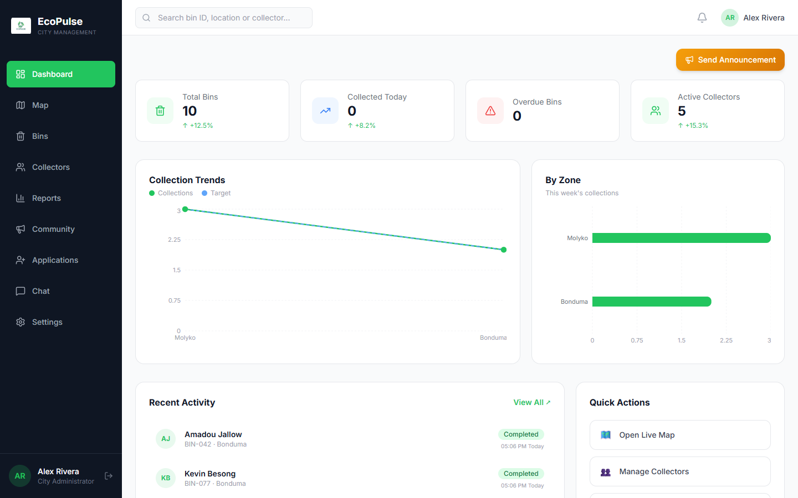
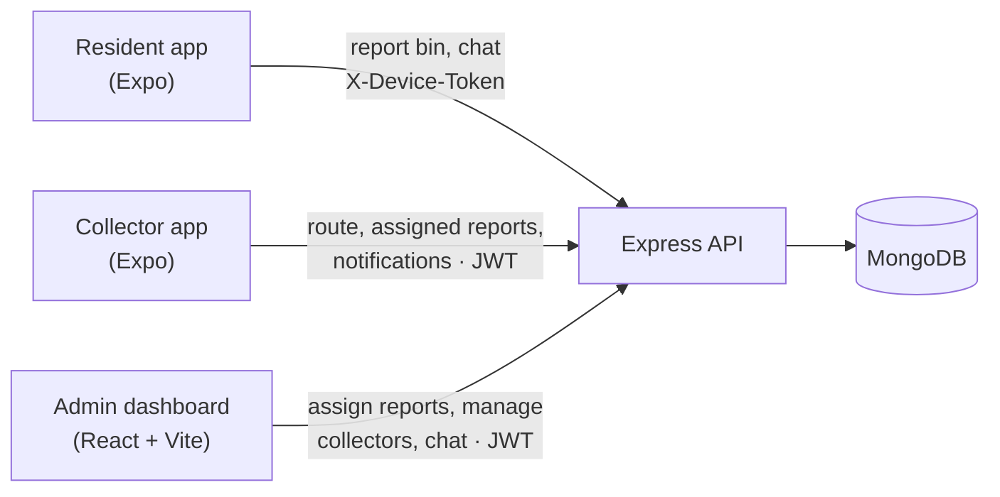
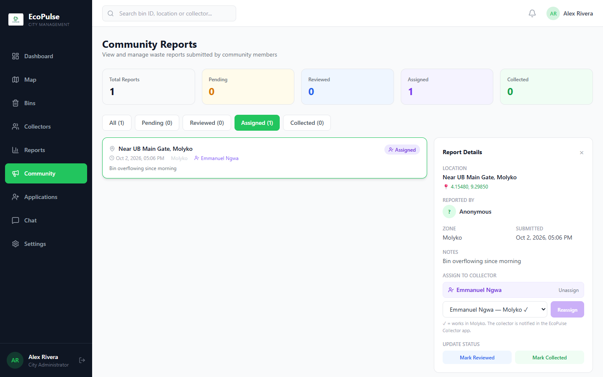
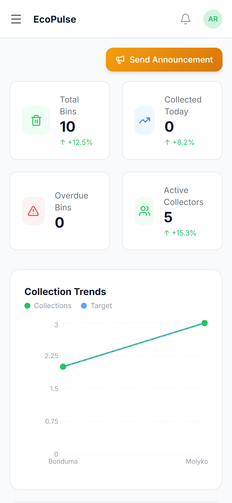
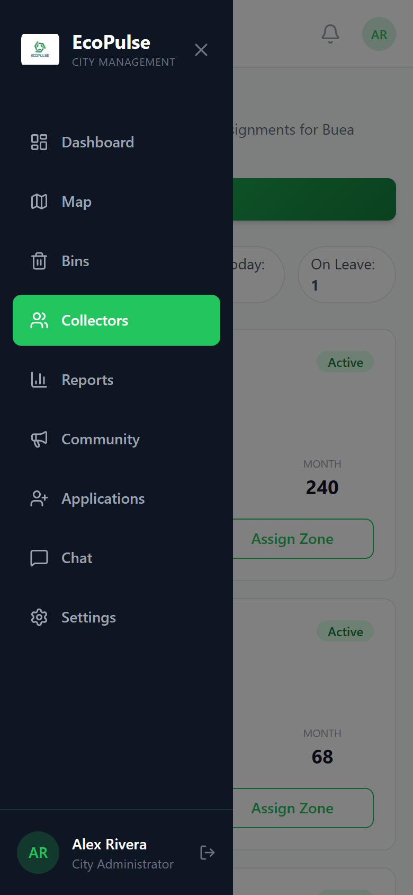
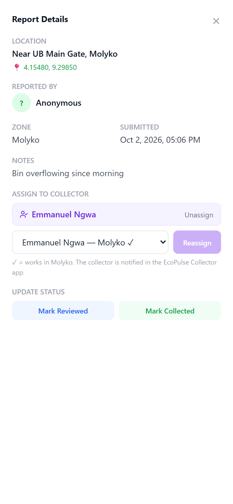

# EcoPulse

**Smart waste management for Buea, Cameroon.** Residents report overflowing bins from their phones, municipal staff see every report on a live dashboard and dispatch the nearest collector, and the collector is notified in their own app, navigates to the spot and marks it cleared. The resident sees the status change from *Pending* to *Collector Assigned* to *Collected*.

EcoPulse is my B.Tech final-year project at the University of Buea. It is a full-stack system: one Node.js API and three clients, built around how waste collection actually works in Buea's four zones (Molyko, Great Soppo, Bonduma and Buea Town).



## What's in the repo

| App | For | Built with |
|---|---|---|
| [`client/`](client) — admin dashboard | Municipal staff | React 19, Vite, Tailwind CSS, Recharts, Leaflet |
| [`community/`](community) — resident app | Residents of Buea | React Native, Expo SDK 57 |
| [`collector/`](collector) — collector app | Waste collection crews | React Native, Expo SDK 57 |
| [`server/`](server) — REST API | All three apps | Node.js, Express 5, MongoDB (Mongoose 9), JWT |



## Features

**Admin dashboard**
- Live map of every bin in Buea, coloured by fill status (OpenStreetMap + Leaflet)
- Community reports with photo, GPS location and note; **assign a report to a collector** (collectors in the report's zone are suggested first), reassign or unassign
- Collector management: create accounts with an email and a temporary password, reset forgotten passwords, assign zones and trucks, view performance
- Leave requests: approve or decline, see who else in the zone is off, end leave early
- Review residents' applications to become collectors (they give the email they'll sign in with), and create the account in one step
- Chat with collectors and residents; zone-wide announcements
- Works on desktop, tablet and phone (sidebar becomes a slide-out menu below 1024px)

<p>
  
</p>

**Resident app (English / French)**
- Report a full bin or illegal dump with a photo and GPS location
- Track your reports as they're reviewed, assigned and collected
- Collection schedule for your zone with reminders; automatic zone detection from GPS
- Nearby bins on a map, chat with the municipality, apply to become a collector

**Collector app (English / French)**
- Today's route with priority bins, turn-by-turn navigation, photo-verified collection
- **In-app notifications** when the admin assigns a report, with a banner and sound
- Assigned reports with the resident's photo and note; close them with a proof photo the admin approves
- Request leave from a calendar; the app switches to *On leave* on the first day and back afterwards
- Chat with the admin, profile with collection statistics

<p>
  
  
  
</p>

## Security design

Residents sign up with just a name and phone number, without a password, so the access model is designed around that:

- **Residents are tied to the phone that registered their number.** The server issues a random device token on first registration and stores only its SHA-256 hash. Chat and report endpoints require the token, so knowing someone's phone number isn't enough to read their conversation or report in their name. If a resident changes phones, an admin can move the number from the dashboard.
- **Collectors sign in with email and password.** Passwords are hashed with bcrypt and never returned by the API. New accounts and admin resets get a one-time temporary password, and the Collector app makes the collector choose their own before going any further.
- **Role checks on every route**: collectors can only read and post in their own chat and can only close reports assigned to them; resident submissions can't set a report's status or assignee.
- **Phone numbers are normalised** to `+237XXXXXXXXX` before they're stored or looked up, so `670 000 001`, `237670000001` and `+237 670 000 001` are the same person.

## Running it locally

**Prerequisites:** Node.js 20.19+, MongoDB (local, or a free [MongoDB Atlas](https://www.mongodb.com/atlas) cluster), and for the mobile apps an Android phone with [Expo Go](https://expo.dev/go) for SDK 57.

### 1. API server

```bash
cd server
npm install
cp .env.example .env      # then set MONGODB_URI and JWT_SECRET
node seed.js              # loads demo data (wipes the target database!)
npm run dev               # http://localhost:5000
```

> `seed.js` deletes existing users, bins, collectors, reports and schedules in the database it connects to. Only run it against a database you're happy to reset.

### 2. Admin dashboard

```bash
cd client
npm install
npm run dev               # http://localhost:5173
```

### 3. Mobile apps

Your phone and computer need to be on the same Wi-Fi network.

```bash
cd community              # or: cd collector
npm install
cp .env.example .env      # set EXPO_PUBLIC_API_URL=http://<your-computer's-LAN-IP>:5000/api
npx expo start
```

Scan the QR code with Expo Go. If you change `.env`, restart with `npx expo start -c` so the new value is picked up.

### Demo accounts (from `seed.js`)

These exist only in a freshly seeded local database:

| App | Login |
|---|---|
| Admin dashboard | `admin@ecopulse.cm` / `admin123` |
| Collector app | `emmanuel@ecopulse.cm` / `collector123` (also `samuel@`, `francis@`, `amadou@`, `kevin@`, `abiba@`) |
| Resident app | no login — enter a name and any phone number |

### Upgrading an existing database

Databases created by older versions need a one-off migration (phone numbers, old collector PINs, bin statuses; dry run by default):

```bash
cd server
node scripts/migrate.js           # shows what would change
node scripts/migrate.js --apply   # writes it
```

Collectors used to sign in with phone + PIN. The migration removes the old PINs and lists collectors who have no email yet: open each one in the dashboard, add their email, then use **Reset password** to give them a temporary password.

## Project status

Working end to end: reporting, assignment, collector notifications, chat, schedules, collector applications, and the responsive dashboard.

Known limitations and next steps:
- Collector notifications arrive while the app is open (polled every 30 s). Push notifications when the app is closed need a development build and Firebase, and are the next step.
- Resident identity is tied to the device rather than verified by SMS. An SMS one-time code would be stronger but needs a paid SMS provider.
- The **Reports & Analytics** page, the map's zone overview panel and the dashboard's trend percentages currently show sample data from `client/src/data/mockData.js`; the other dashboard figures are live.
- The dashboard's search box is not wired up yet.

## Documentation

- [Project report](docs/EcoPulse-Project-Report.md) — problem statement, system design, implementation and testing
- [Article](article/ecopulse-medium-article.md) — the story behind the project
- [UI mockups](design/ui-mockups) — the original dashboard designs

## Author

Built by [Blane](https://github.com/Blane47) as a final-year B.Tech project at the University of Buea, Cameroon.

## License

Released under the [MIT License](LICENSE).
